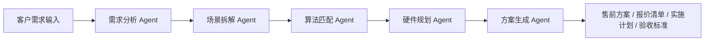

# AI Agent 驱动的实验室物联网智能管理方案 Demo

本项目是一个用于 GitHub 展示的 AI Agent / AI 驱动项目 Demo，围绕“实验室物联网智能管理系统”和“AI 算法场景化应用方案”展开。

项目重点展示如何通过多个 AI Agent 协同完成：

- 客户需求分析
- 场景痛点拆解
- 算法能力匹配
- 软硬件资源规划
- 售前方案生成
- 实施计划输出
- 验收指标生成

> 适合用于 AI 工具额度申请、Agent 项目展示、GitHub 作品集、售前技术支持能力展示。

---

## 一、项目解决的核心痛点

传统实验室、校园、园区管理系统通常存在以下问题：

1. 设备、摄像头、门禁、电梯、传感器等数据分散，缺少统一平台管理；
2. 安全巡检依赖人工查看视频，效率低、漏报率高；
3. 告警规则固定，难以根据实际场景灵活配置；
4. 售前方案、报价清单、算法说明、技术架构图制作周期长；
5. 客户需求经常比较模糊，需要快速转化为可落地的技术方案；
6. 视频 AI 项目需要根据摄像头路数、算法复杂度、存储周期等因素估算服务器、GPU、存储和带宽资源。

本项目通过 AI Agent 拆解复杂需求，将“客户描述”自动转化为“技术方案”。

---

## 二、核心逻辑流



### 逻辑说明

1. 输入客户场景，例如实验室安全、校园安全、访客通行、设备监控等；
2. 需求分析 Agent 提取客户核心诉求；
3. 场景拆解 Agent 将业务场景拆解为功能模块；
4. 算法匹配 Agent 根据场景匹配 AI 算法能力；
5. 硬件规划 Agent 根据摄像头路数、帧率、分辨率、算法数量等估算资源；
6. 方案生成 Agent 输出完整售前方案。

---

## 三、项目目录

```text
ai-agent-iot-solution-demo
├── README.md
├── requirements.txt
├── main.py
├── config
│   └── scenario_config.json
├── agents
│   ├── demand_agent.py
│   ├── scenario_agent.py
│   ├── algorithm_agent.py
│   ├── hardware_agent.py
│   └── proposal_agent.py
├── docs
│   ├── project_description.md
│   ├── agent_workflow.md
│   └── github_submission_text.md
└── examples
    └── sample_input.json
```

---

## 四、快速运行

### 1. 安装依赖

```bash
pip install -r requirements.txt
```

### 2. 运行 Demo

```bash
python main.py
```

运行后会根据 `examples/sample_input.json` 自动生成一份 AI 售前技术方案。

---

## 五、示例输出内容

系统会输出：

- 项目核心痛点
- 功能模块拆解
- 推荐算法能力
- 服务器 / GPU / 存储 / 网络配置建议
- 实施周期建议
- 验收指标建议
- 售前方案正文

---

## 六、适用场景

本项目可用于以下场景：

- 实验室物联网管理系统
- 校园安全 AI 算法平台
- 园区设备监控平台
- 视频 AI 算法售前方案
- 智慧校园 / 智慧园区 / 智慧实验室方案
- AI Agent 项目能力展示

---

## 七、技术特点

- 多 Agent 协同工作流
- 支持长链推理式方案生成
- 支持视频 AI 资源估算
- 支持算法能力自动匹配
- 支持售前方案结构化输出
- 适合二次扩展为真实大模型 API 调用版本

---

## 八、后续可扩展方向

1. 接入 OpenAI / 通义千问 / DeepSeek / Claude 等大模型 API；
2. 接入向量数据库，形成企业知识库；
3. 接入 Excel 报价模板，自动生成报价清单；
4. 接入 Word / PPT 模板，自动生成投标文件；
5. 接入真实摄像头、物联网设备和告警平台；
6. 增加多轮对话式需求确认能力。
